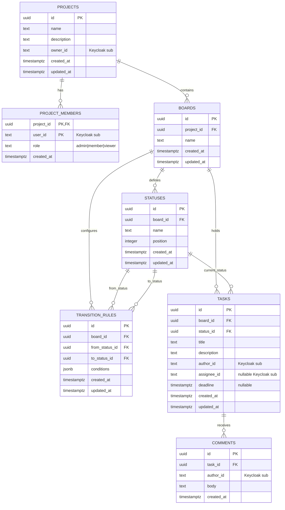

# Entity relationship model

Keycloak is the identity source. TaskFlow deliberately stores its immutable
`sub` claim as `user_id` instead of copying credentials or profiles into the
application database.

## Table responsibilities

- `projects` is the aggregate root for authorization. `owner_id` is immutable;
  ownership is stronger than a mutable membership role.
- `project_members` is the project-scoped access-control list. Its composite
  key prevents duplicate membership.
- `boards` partitions independent workflows inside a project.
- `statuses` stores user-visible columns. `position` is the primary display
  order; IDs provide a deterministic tie-break while two reorder PATCH requests
  are in flight.
- `transition_rules` stores one directed edge per `(board, from, to)`. Conditions
  are JSON so new predicates can be added without changing the graph schema.
- `tasks` references a status on its own board; database and application checks
  prevent cross-board status assignments.
- `comments` supplies the audit-friendly discussion history and the
  `requires_comment` predicate.

Foreign keys cascade for aggregate-owned rows. A status referenced by a task or
a rule cannot be removed until those references are changed, so deleting a
column cannot silently orphan work.
