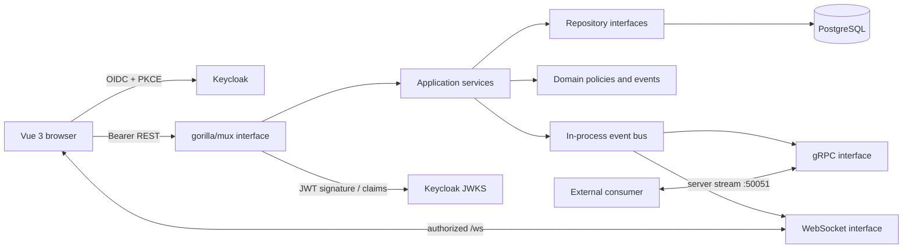
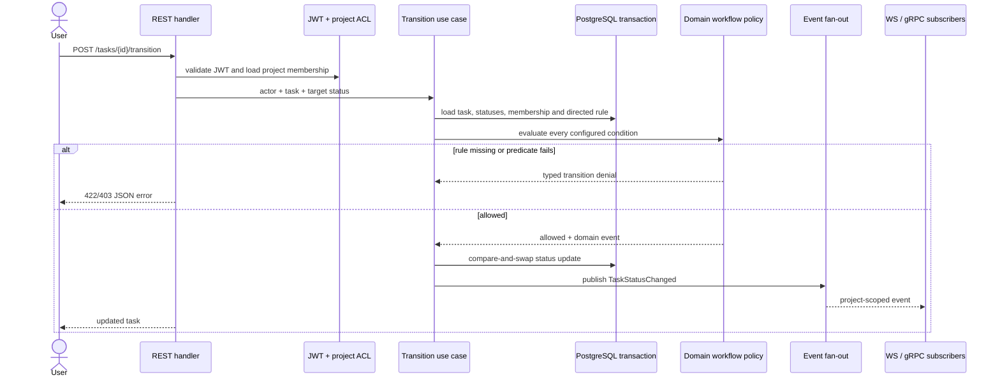

# Architecture

TaskFlow uses a modular monolith for the MVP. Domain behavior is kept independent
of HTTP, SQL, Keycloak, WebSocket and gRPC so the same invariant is enforced no
matter which interface initiated work.

## Layer boundaries

- **Domain** owns entities, roles, workflow condition types, transition policy,
  domain errors and `TaskEvent` values such as `task.transitioned`. It imports no transport or database
  package.
- **Application** coordinates repositories, permission checks, transactions and
  event publication. Its dependencies are interfaces, which permits focused
  tests with fakes.
- **Infrastructure** implements PostgreSQL repositories, Keycloak/JWKS token
  verification, the realtime hub and process configuration.
- **Interfaces** translates HTTP, WebSocket and gRPC messages to application
  commands and maps typed errors to protocol-specific responses.

Dependencies point inward. HTTP handlers never issue SQL directly, and database
records are mapped to domain values before rules are evaluated.

## Status-change flow

The database commit is the source of truth. Publication happens after commit so
clients never observe a state that later rolls back. In this MVP, process failure
between commit and publication can lose a notification. Production hardening
would store the domain event in a transactional outbox and deliver it through a
durable broker; consumers should already treat event IDs as idempotency keys.

## Trust and concurrency

- Client-supplied user IDs never determine the actor; the JWT `sub` does.
- Project membership is checked for every aggregate read or write. Global
  WebSocket streams re-check it for each event so membership changes take
  effect without reconnecting; project-filtered streams are authorized before
  upgrade.
- CORS and WebSocket origins use an explicit allow-list.
- SQL is parameterized. UUIDs and request bodies are validated at the boundary.
- The final status update includes the previously read status in its `WHERE`
  clause. A concurrent move therefore becomes a conflict instead of silently
  overwriting newer state.
- gRPC requires the same Keycloak Bearer token and project membership as REST.
  Add TLS or mTLS before exposing it outside the local Compose environment.
